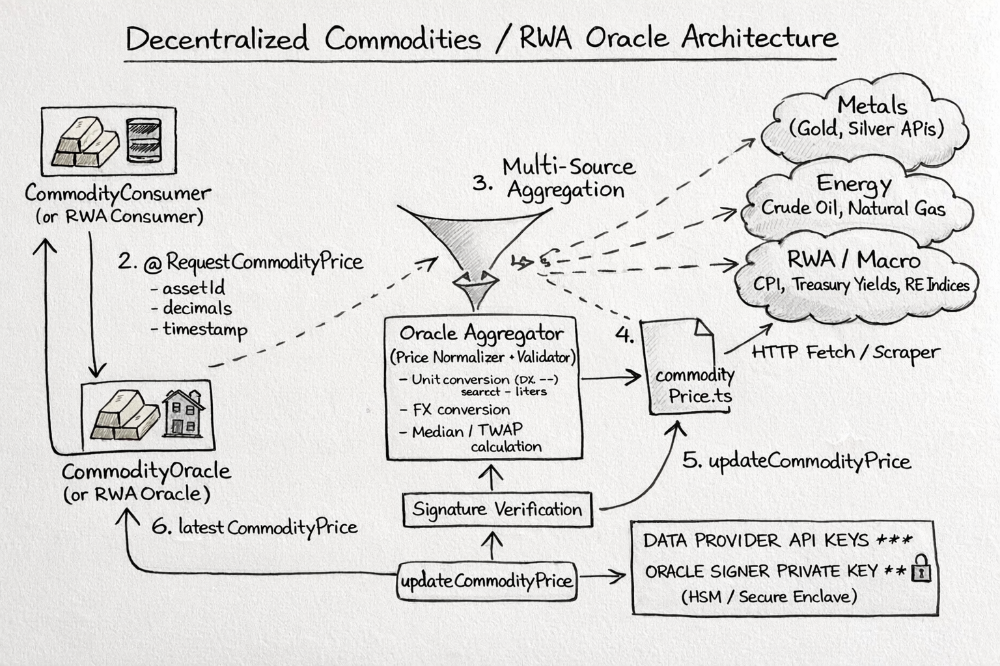

# CommodityOracle

A decentralized oracle system for commodity price data on the blockchain, featuring secure signature-based price updates and a consumer contract for easy price queries.

## Overview

The CommodityOracle system consists of two main smart contracts:

1. **CommodityOracle**: The core oracle contract that stores and manages commodity price data with cryptographic signature verification
2. **CommodityConsumer**: A consumer contract that provides convenient interfaces to query price data from the oracle

## Architecture




## Deployed Contract Addresses

### CommodityOracle
[`0xE370b43b3405148E6D5Aff0F1DB151C6C17c3051`](https://sepolia.mantlescan.xyz/address/0xE370b43b3405148E6D5Aff0F1DB151C6C17c3051#readContract)

### CommodityConsumer
[`0x0eba74872672ee3FC81E55239967BFF142E52fC7`](https://sepolia.mantlescan.xyz/address/0x0eba74872672ee3FC81E55239967BFF142E52fC7#readContract)

## Check Feed IDs

View the complete list of supported commodities and their AssetIds (bytes32) in an interactive table:

🔗 **[View Commodity Table with Feed IDs](https://raw.githack.com/Kali-Decoder/CommodityOracle/main/docs/commodityTable.html)**

The table displays all 106 supported commodities including:
- Energy commodities (Natural Gas, Crude Oil, Brent Oil)
- Cryptocurrency ETFs (Bitcoin, Ethereum)
- Stock market indices (S&P 500, NASDAQ)
- Individual stocks (Apple, Microsoft, Tesla, etc.)
- Currencies (USD pairs, EUR, GBP, JPY, etc.)
- Precious metals (Gold, Silver, Copper)

Each entry includes the AssetId (bytes32) that you can use to query prices from the oracle contracts.

## Contracts

### CommodityOracle

The main oracle contract that stores commodity price data. It features:

- **Signature-based updates**: All price updates must be signed by the authorized oracle signer
- **Replay protection**: Uses message hashing to prevent duplicate updates
- **Staleness protection**: Rejects price data older than 15 minutes
- **Bulk updates**: Supports updating multiple commodity prices in a single transaction
- **Ownable**: Uses OpenZeppelin's Ownable for access control

**Key Functions:**
- `updateCommodityPrice()`: Update a single commodity price
- `updateCommodityPricesBulk()`: Update multiple commodity prices at once
- `getLatestPrice()`: Retrieve the latest price for a specific asset

### CommodityConsumer

A consumer contract that provides convenient interfaces to interact with the CommodityOracle:

- **Single asset queries**: Get price for a specific asset ID
- **Bulk queries**: Get prices for multiple assets in one call
- **Convenience functions**: Pre-built functions for common commodities (e.g., Natural Gas)

**Key Functions:**
- `getPriceByAssetId()`: Get price data for a specific asset
- `getPricesByAssetIds()`: Get price data for multiple assets
- `getNaturalGasPrice()`: Convenience function for Natural Gas (NG-USD)

## Usage

### Querying Prices

To query prices from the consumer contract, you can use the deployed CommodityConsumer address:

```solidity
// Get Natural Gas price
CommodityConsumer consumer = CommodityConsumer(0x0eba74872672ee3FC81E55239967BFF142E52fC7);
(uint256 id, uint256 price, uint256 timestamp) = consumer.getNaturalGasPrice();

// Get price by asset ID
bytes32 assetId = keccak256("NG-USD");
(id, price, timestamp) = consumer.getPriceByAssetId(assetId);
```

### Updating Prices

Price updates must be signed by the authorized oracle signer and submitted to the CommodityOracle contract:

```solidity
CommodityOracle oracle = CommodityOracle(0xE370b43b3405148E6D5Aff0F1DB151C6C17c3051);
oracle.updateCommodityPrice(assetId, id, price, timestamp, signature);
```

## Security Features

- **ECDSA Signature Verification**: All price updates are cryptographically signed
- **Replay Protection**: Message hashing prevents duplicate updates
- **Staleness Protection**: Maximum 15-minute delay for price data
- **Access Control**: Ownable pattern for contract administration
